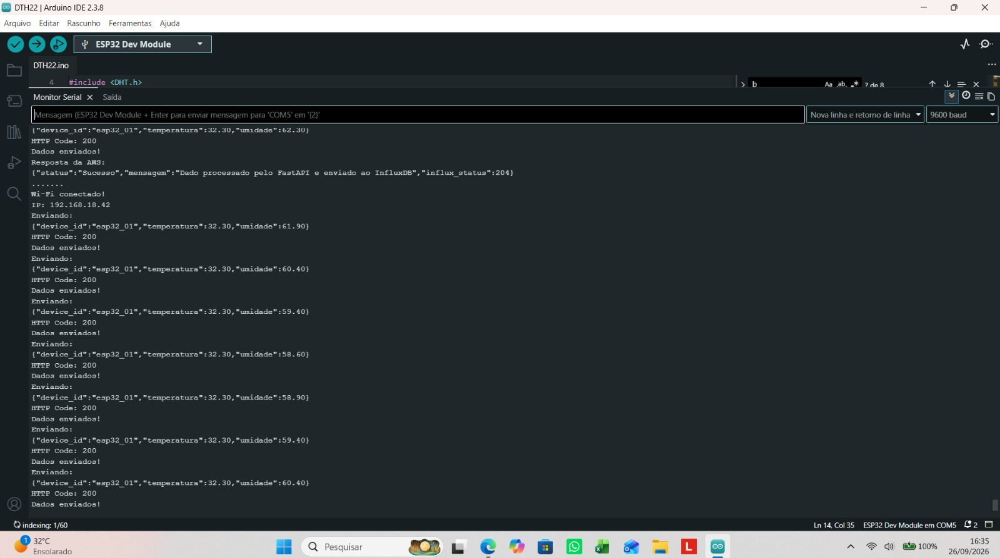
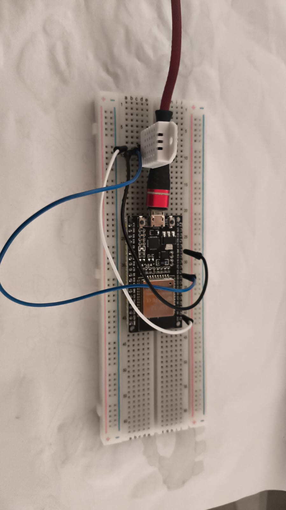

# 📟 Módulo IoT & Simulação - ESP32

> **Módulo:** Coleta de Dados e Transmissão Hardware  
> **Responsável:** Paulo  
> **Projeto:** TCC - Monitoramento e Processamento de Anomalias IoT  

---

## 🎯 Descrição do Módulo
Este módulo compreende a camada física e de simulação do sistema IoT. É responsável por configurar o microcontrolador ESP32 para leitura dos dados de temperatura e umidade, além de realizar a transmissão das requisições HTTP POST para a API de ingestão serverless na AWS.

---

## 📸 Evidências de Funcionamento

### 1. Implementação do Firmware no ESP32
*Código-fonte embarcado responsável pela leitura dos sensores e envio dos payloads JSON:*

### 2. Dispositivo e Montagem Física
*Montagem do protótipo e microcontrolador ESP32 em operação:*

